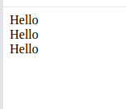
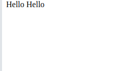
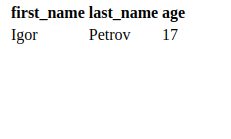

# Блочные и строчные элементы html

+ `div`: блочный элемент 
```html
<div>Hello</div>
<div>Hello</div>
<div>Hello</div>
```
Результат:



Слова располагаются друг за другом, сверху вниз, `div` **блочный тег**  
+ `span`: строчный элемент
```html
<span>Hello</span>
<span>Hello</span>
```
Результат:



Слова идут друг за другом в одну строку, `span` **строчный тег**
+ `table`: сам по себе блочный элемент
```html
<table>
    <tr> 
        <th>first_name</th>
        <th>last_name</th>
        <th>age</th>
    </tr>
    <tr>
        <td>Igor</td>
        <td>Petrov</td>
        <td>17</td>
    </tr>

</table>
```

Результат:



Внутри тега `table` выделяются еще 3 тега:
+ `tr`: блочный тег, создает новую строку таблицы, то есть записи с новой строки
+ `th`: строчный тег, создает столбец с выраженным шрифтом, помечая столбец как параметр шапки таблицы
+ `td`: строчный тег, создает столбец с обычным шрифтом, помечая столбец как значение параметра таблицы